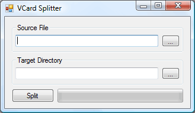

# VCardSplitter

When importing and exporting contact data, sometimes you will come across
a single VCard (.vcf) that contains multiple contacts. Outlook has no native
way to read this file. 

This simple Windows Forms application splits a single file into one VCard
for each contact, allowing you to drag-and-drop the resulting files into
Outlook or Exchange.

# License

Copyright © 2008 willsllc, [Microsoft Public License (Ms-PL)](LICENSE)
